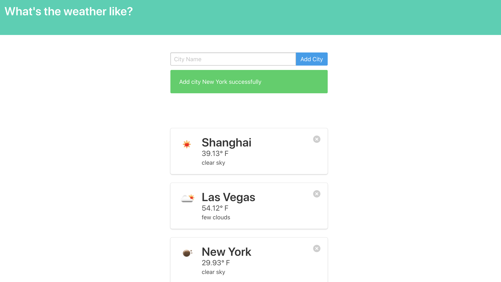

# weather app using Flask

git clone https://github.com/gpldirk/weather-app.git

source ./venv/bin/activate

pip3 install -r requirements.txt

指定app.py中的open weather app id： \
'http://api.openweathermap.org/data/2.5/weather?q={city}&units=imperial&appid={{your app id}}'

python3 app.py

deactivate ./venv/bin/activate
